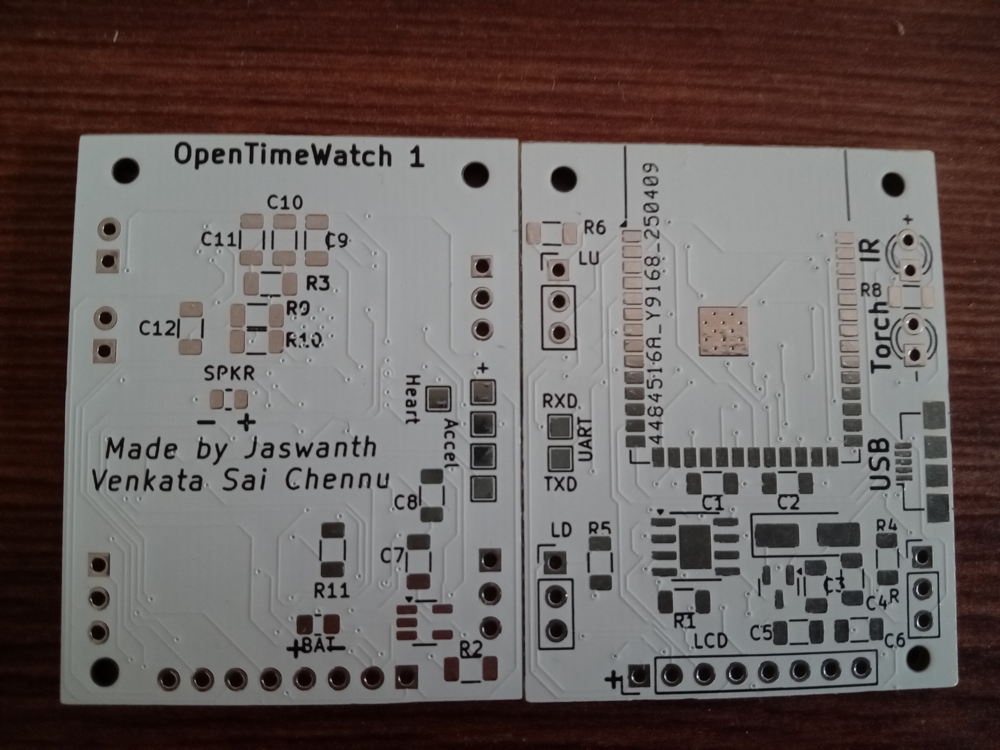

# OpenTimeWatch-1 Rev 1

An ESP32-S3 based open source smartwatch running [OpenTimeWatch OS](https://github.com/OpenTimeWatch-Project/OpenTimeWatch-OS). 

The OpenTimeWatch-1 is a DIY affordable smartwatch which can be used as a fitness tracker, home automation device, ethical hacking device and more!
It contains a powerful ESP32-S3 dual core processor which unlocks even more potential for the watch and eqquiped with WiFi, bluetooth and an IR transmitter
this watch can controll and communicate with a variety of devices. MPU6050 gives a sense of motion, the torch and the speaker gives more accesibility.
The watch's software is very flexible and allows you to write your own software without any restrictions. And by being open source people can create custom
cases and versions of the watch to their liking.
                                                                         
Specifications:-
1. ESP32 S3 WROOM 1:- Flash: 16MB, PSRAM: 8MB
2. MPU6050 (accelerometer)
3. IR LED
4. Torch
5. Speaker
6. 1.44" LCD TFT display (Not touch screen)
7. Li-Po battery charging (TP4056)
8. 3 navigation buttons
9. Micro USB connector
10. Slide on/off switch (Optional)
11. Heart rate sensor

Note:- This watch is WIP and has multiple issues and not recomeneded to be used, might get superseded by Rev 2.
